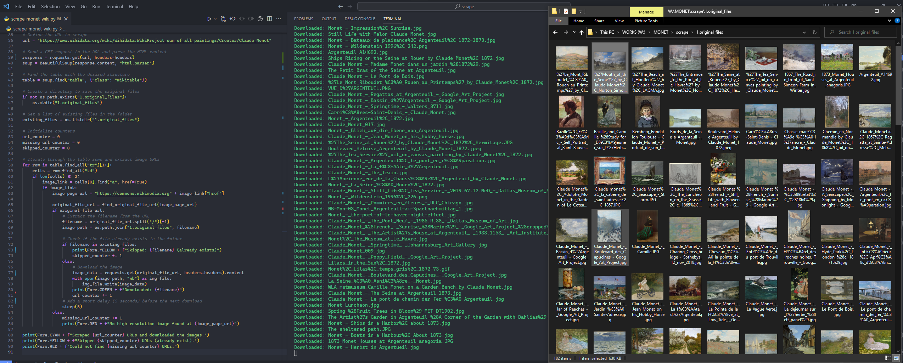

# Monet Painting Scraper

This is a Python script that scrapes a Wikipedia page for image URLs and downloads the corresponding images. The script uses the requests library to send HTTP requests to the Wikipedia page and the BeautifulSoup library to parse the HTML content of the page. The script then iterates through the table rows of the page, extracts image URLs, and downloads the corresponding images using the requests library. The script also logs the progress of the scraping and downloading process to a log file.



## Getting Started

To use this script, you will need to have Python 3 installed on your machine. You will also need to install the following Python libraries:

- requests
- beautifulsoup4
- colorama

You can install these libraries using pip. For example:

```bash
pip install requests beautifulsoup4 colorama
```

## Usage

To use the script, simply run the scrape_monet_wiki.py file using Python.

```bash
python scrape_monet_wiki.py
```

The script will scrape the Wikipedia page and download the corresponding images to a folder called 1.original_files. The progress of the scraping and downloading process will be logged into a file called ```download.log```.

License
This project is licensed under the MIT License - see the [LICENSE](LICENSE) file for details

## Disclaimer

> Please note that this project is intended for educational purposes only. When scraping data from websites, it is important to follow ethical and legal guidelines. We recommend using the official [Wikimedia API](https://api.wikimedia.org/wiki/Getting_started_with_Wikimedia_APIs#:~:text=Wikipedia%20and%20other%20Wikimedia%20projects,to%20your%20projects%20and%20apps.) and following the [API Etiquette](https://www.mediawiki.org/wiki/API:Etiquette) to avoid getting banned.  

## Donate

Additionally, please consider donating to the Wikimedia Foundation to support their mission of providing free knowledge to the world.  

You can donate [here](https://donate.wikimedia.org/w/index.php?title=Special:LandingPage&country=IT&uselang=en&utm_medium=wmfSite&utm_source=113&utm_campaign=comms).
